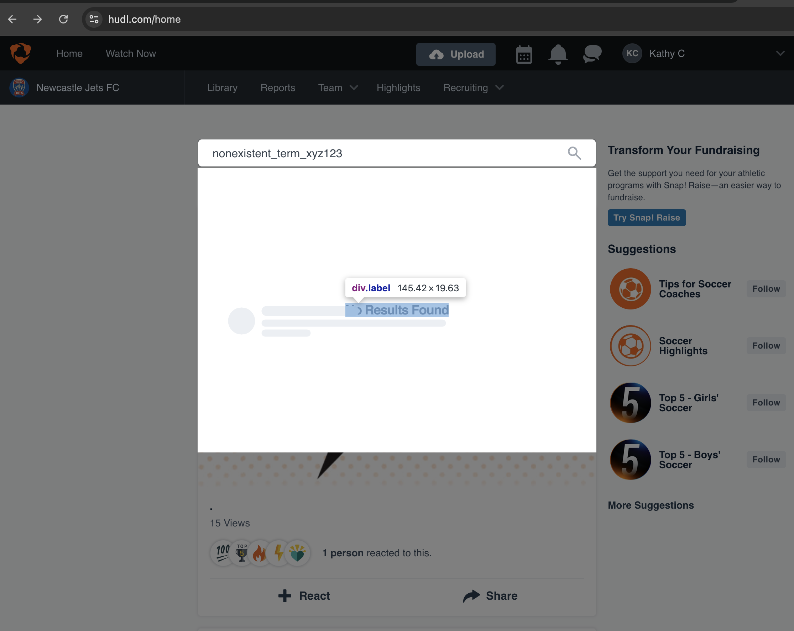

# 🐞 Bug Report: Search Bar No Results State - Hudl Home Page

**Environment:**
- App: [https://www.hudl.com/home](https://www.hudl.com/home)
- Browser: Chrome
- Screen Resolution: 768x965
- Logged-in User: Kathy C (Newcastle Jets FC)

---

## 🧪 Steps to Reproduce
1. Log in to Hudl and navigate to the Home page.
2. Use the search bar at the top of the page.
3. Enter a clearly invalid term such as `nonexistent_term_xyz123`.
4. Press `Enter` or click the magnifying glass icon.

---

## 🔍 Expected Result
- A user-friendly message is shown indicating that no results were found.
- Ideally, the UI provides suggestions or next actions (e.g., clear filter, try a new search).
- The state should be programmatically identifiable for automation and accessibility.

---

## ❌ Actual Result
- The UI displays a visual placeholder saying **"No Results Found"**, but the feedback is purely visual.
- There is no reliable testable selector or accessible label.
- The span with the message is deeply nested and not clearly defined by semantic roles or `data-qa-id` attributes.

---

## 🖼️ Screenshots
### No Results Overlay (Various States)
  
**File path:** `bug-report/evidence/no-results-overlay.png`

  
**File path:** `bug-report/evidence/no-results-overlay-1.png`

  
**File path:** `bug-report/evidence/no-results-overlay-2.png`

### Selector Preview in DevTools
  
**File path:** `bug-report/evidence/no-results-dom.png`

> Element shown: `No Results Found` within `div.label`

---

## 💡 Recommendation
- Add a clear, accessible container element (e.g., `data-qa-id="no-results"` or `role="alert"`) around the message.
- Consider using an `aria-live` region for better screen reader support.
- Improve testability by using unique identifiers for result states.

---

## 📎 Impact
- Difficult to automate negative test scenarios.
- Limited accessibility.
- Inconsistent experience across screen sizes.

---

## ✅ Suggested Fix Priority
**Medium** — Doesn’t block users, but affects testing and accessibility compliance.

---

Reported by: QA Automation Engineer  